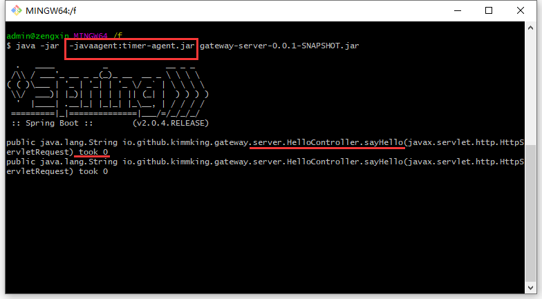

## 第 9 节课作业实践
#### 1、（选做）使 Java 里的动态代理，实现一个简单的 AOP。

位置： `work1 --> JavaAopDemo`

#### 2、（必做）写代码实现 Spring Bean 的装配，方式越多越好（XML、Annotation 都可以）
位置： `work2 --> BeanDemo`

#### 3、（选做）实现一个 Spring XML 自定义配置，配置一组 Bean，例如：Student/Klass/School。
未做

#### 4.1 （挑战）讲网关的 frontend/backend/filter/router 线程池都改造成 Spring 配置方式；

位置： `work41 --> ThreadPoolConfiguration 、HttpOutboundHandler、HttpInboundHandler`

#### 4.2 （挑战）基于 AOP 改造 Netty 网关，filter 和 router 使用 AOP 方式实现；

位置： `work41 --> AopConfiguration`

```
1.启动 work41-server 包下的三个测试用 HttpServer
2.启动 Homework0501Application，访问 http://localhost:8888
```

#### 4.3 （中级挑战）基于前述改造，将网关请求前后端分离，中级使用 JMS 传递消息；

位置：`work41 --> jms`

```
在4.2基础上，单独运行JmsReceiver.java。由于request无法序列化存入消息，接收消息后该如何与 request进行关联- -。
```

#### 4.4 （中级挑战）尝试使用 ByteBuddy 实现一个简单的基于类的 AOP；

位置：`work44 --> ByteBuddyDemo`

#### 4.5 （超级挑战）尝试使用 ByteBuddy 与 Instrument 实现一个简单 JavaAgent 实现无侵入下的 AOP。
位置:  代码见 `work45 --> TimerAgent` ；对所有方法名包含 `fun`，或者 `hello` 的方法进行增强

打包后的 `jar` 包 --> `timer-agent.jar`

测试效果：启动 `gateway.jar` 后，访问 http://localhost:8088/api/hello



## 第 10 节课作业实践

1. #### （选做）总结一下，单例的各种写法，比较它们的优劣。

   - 懒汉式，启动时直接初始化，即使未使用到也会占用资源

   - 饿汉式，使用时加载，存在线程安全问题

   - 加锁双重检测，线程安全，不美观，序列化问题需实现 `readResolve`

     > ```
     > public class Singleton {  
     >     //volatile禁止指令重排序，保证可见性  
     >     private static volatile Singleton instance;  
     >     private Singleton() {  
     >     }  
     >     public static Singleton getInstance() {  
     >         if (instance == null) {  
     >             synchronized (Singleton.class) {  
     >                 if (instance == null) {  
     >                     instance = new Singleton();  
     >                 }  
     >             }  
     >         }  
     >         return instance;  
     >     }  
     > }
     > ```

   - 基于枚举的方式，线程安全，无序列化问题

     > ```
     > public enum SingletonEnum {  
     >     INSTANCE;  
     >     private Singleton instance = null;  
     >   
     >     private SingletonEnum() {  
     >         instance = new Singleton();  
     >     }  
     >   
     >     public Singleton getInstance() {  
     >         return instance;  
     >     }  
     > }
     > ```

   - 静态内部类，由`jvm` 保证线程安全，序列化问题需实现 `readResolve`

     > ```
     > public class Singleton implements Serializable {
     >     private Singleton() {  
     >     }
     >     private static class SingletonHandler {  
     >         private static Singleton instance = new Singleton();  
     >     }
     >     public static Singleton getInstance() {  
     >         return SingletonHandler.instance;  
     >     }  
     >     private Object readResolve(){  
     >         System.out.println("read resolve");  
     >         return SingletonHandler.instance;  
     >     }
     > }
     > ```

2. #### （选做）maven/spring 的 profile 机制，都有什么用法？

   可以用于配置一组环境，不同环境才有不同的配置，根据激活项。灵活的变换环境参数

   - `@Profile` 条件装配

   - `spring.profiles.active=profilename`  配置不同环境下的配置文件

   - `maven` 中如果 `profile` 定义在 `settings.xml` 中，则影响全局，例如配置远程仓库等

   - 如果配置在 `pom.xml` 中，则通过 `mvn package –P  profilename` 应用相应的环境

     > ```
     > <profiles> 
     >     <profile> 
     >         <id>profileTest1</id> 
     >         <properties> 
     >             <hello>world</hello> 
     >         </properties> 
     >         <activation> 
     >             <activeByDefault>true</activeByDefault> 
     >         </activation> 
     >     </profile> 
     > 
     >     <profile> 
     >         <id>profileTest2</id> 
     >         <properties> 
     >             <hello>hello world</hello> 
     >         </properties> 
     >     </profile> 
     > </profiles> 
     > ```

3. #### （必做）给前面课程提供的 Student/Klass/School 实现自动配置和 Starter。

   位置：DemoAutoConfiguration

   

4. #### （必做）研究一下 JDBC 接口和数据库连接池，掌握它们的设计和用法：

   位置：HikariCPDemo

  

  附加题（可以后面上完数据库的课再考虑做）：

​	.............