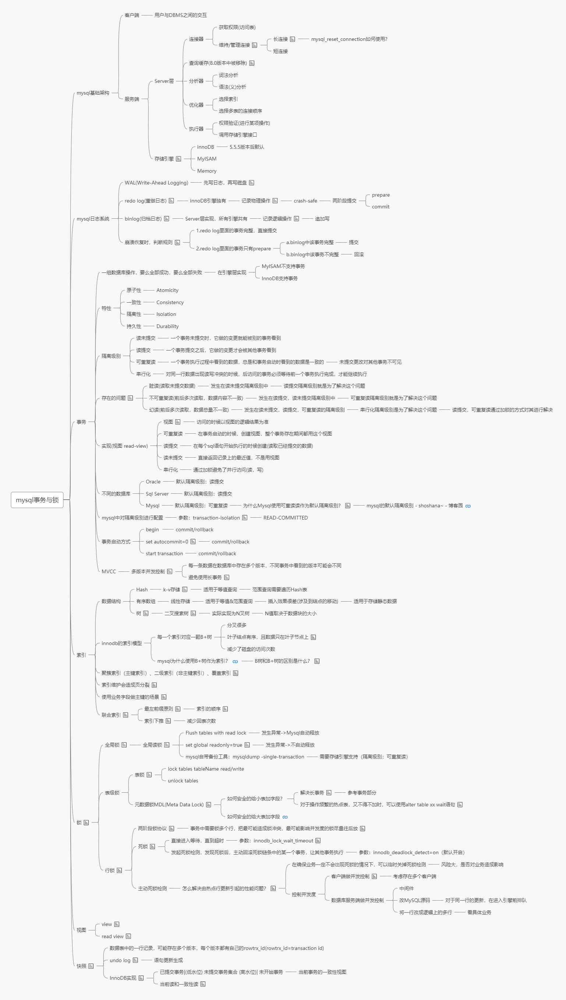

## 第 13 节课作业实践
#### 2、（必做）按自己设计的表结构，插入100万订单模拟数据，测试不同方式的插入效率。
- 代码实现见 `BatchInsertDemo`，执行时长约 `8s`;

- 存储过程实现如下，时长约 42s ：

```
begin
  declare i int;
  declare insert_sql text;
  set i=1;
  set insert_sql = 'insert into t_order values';
  while(i<=1000000)do
    set insert_sql = CONCAT(insert_sql,"(",i,",",i,",",i,",",i,",'",NOW( ),"','",NOW( ),"')",",");
    IF i%100=0 THEN 
       set @insert_sql = LEFT(insert_sql,CHAR_LENGTH(insert_sql)-1);
       PREPARE stmt FROM @insert_sql ;
       EXECUTE stmt;
       DEALLOCATE PREPARE stmt;
       set insert_sql = 'insert into t_order values';
    END IF;
    set i=i+1;
  end while;
end
```

#### 6、（选做）尝试自己做一个 ID 生成器（可以模拟 Seq 或 Snowflake）。
 分析注释见 `snowFlake`

### 思维导图



## 第 14 节课作业实践
#### 1、（选做）配置一遍异步复制，半同步复制、组复制。

是的

#### 2、（必做）读写分离-动态切换数据源版本1.0

 

#### 3、（必做）读写分离-数据库框架版本2.0

是的

#### 4、（选做）读写分离-数据库中间件版本3.0

是的 

#### 5、（选做）配置 MHA，模拟 master 宕机

暗示

#### 6、（选做）配置 MGR，模拟 master 宕机

 阿斯达

#### 7、（选做）配置 Orchestrator，模拟 master 宕机，演练 UI 调整拓扑结构

 