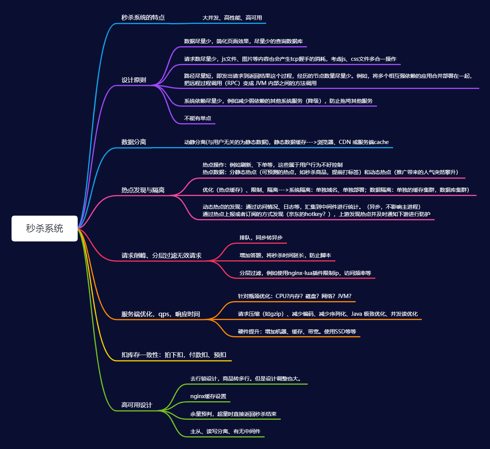

# 第 28 课作业实践

## 秒杀系统的设计

#### 秒杀的特点：

- 高并发、海量用户、高性能、高可用

#### 难点：

- 大量的并发读、写，应用难以支撑
- 超卖问题

## 设计原则：

- 数据量、请求量、调用路径尽量少（短）
- 分布式部署，避免单点问题

#### 动静分离，服务拆分

- 将与用户状态无关的数据静态化，必要的数据才调用后台。前台使用浏览器缓存或 `CDN` 等方式缓存 `js、css` 文件。

- 订单、用户等关联服务拆分为微服务，分布式部署，压力大的服务集群资源方便调整，不进行强关联。秒杀只会在成功时才会创建订单，而秒杀成功的是极少数，重点还是在大量的查库存、减库存操作上。
- 利用 `Nginx` 中的缓存配置功能，对热点接口进行缓存，很多页面或者接口响应数据都可以进行静态化处理。

#### 请求削峰，分层过滤

- 可以增加答题步骤，体验不太好但延长了秒杀时间，也可以应对脚本秒杀；
- 在转发层，通过 `nginx-lua` 等脚本方式限制 `IP` 的访问频率，避免大量恶意刷单的问题
- 使用消息队列来应对瞬时流量的冲击，将同步操作转为异步处理；
- 预判库存余量，排队的数量已经大于库存余量后，后续的请求直接返回秒杀失败。

#### 服务分发，服务优化

- 采用 `nginx、lvs` 等负载均衡器。分发到多个服务上进行分散处理；

- 压缩请求，减少编码，针对瓶颈优化、`CPU`、内存、网络、`JVM` 等；

- 数据库去行锁设计（调整较大），业务上分为多行，或者使用数据库排队插件；

  

#### 库存扣减

- 拍下扣库存，最简单的方式，性能最佳；
- 付款扣库存，容易超卖；
- 预扣库存，拍下时预扣库存，付款后实际扣减。

对于不需要复杂事务操作的库存扣减来说，可以采用 `Redis+ lua` 的方式在内存中扣减库存，性能也能得到保障；

对于有总库存，`sku` 号 等需要事务操作的库存扣减，还是要使用数据库来进行扣减。此时，为了提高性能，可以采用数据库主从集群，在应用中采用排队、以及取消数据库行锁的方式来增加处理性能。

取消行锁有两种方式：一是在业务上将商品直接划分为多行，每个商品具有标识号。但是设计的业务改动会很大，可以类比使用 TCC 事务所需要的改动；二是通过类似于阿里发布的 `mysql` 补丁包的方式，将同一行上的行锁切换操作变为排队等待。

#### 提高可用性

- 服务降级，暂时停止某些依赖的其它服务，提高主要系统的处理能力
- 主从集群部署，读写分离。各中间件均采用单独的集群部署

#### 参考内容

- [秒杀系统的架构解决之道](https://www.infoq.cn/article/solution-to-the-architecture-of-spike-system)

- [如何设计一个秒杀系统](https://time.geekbang.org/column/intro/127)
- [36|Redis支撑秒杀场景的关键技术和实践都有哪些？](https://time.geekbang.org/column/article/307421)

#### 思维导图：

